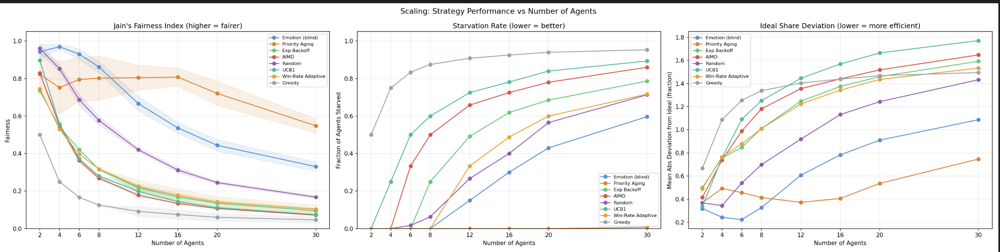
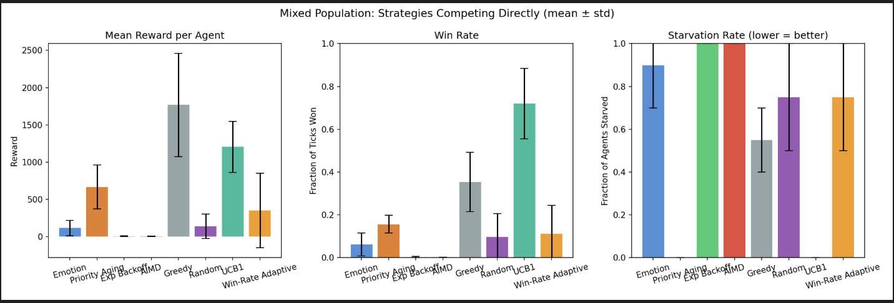

# Measuring Starvation and Fairness in Resource Competition Between Agents with "Emotions"

## Overview

This project builds a multi-agent resource competition simulation in which agents compete for limited resources organized into reward tiers. The primary aim is to embed an "emotion"-inspired strategy for agent cooperation in an asynchronous system that maintains only local knowledge.

### Emotion-Inspired Strategy
Each agent maintains interpretable internal state variables inspired by the emotions that come up from winning/losing.  Losing, especially multiple times, tells the loser they may need to improve their efforts or give up and try something else.  Winning however, can indicate that the winner could be exerting too much effort, and perhaps they could win with less effort.  Additionally, winning and hogging resources is a non-social behavior and can inspire the dislike of one's community.  I approach the emotion strategy from the lens of wanting to win ther resource, but also wanting to maintain and win in social inclusion.  The emotion system balances and explores reward reinforcement and the social costs as decision drivers. Ulitmately, I am primarily interested in how using emotions as the driver of behavior can influence starvation and fairness results in comparrsion to other resource competition strategies. This project is inspired as an implementation of the paper I did for this class.

The core question: **do emotion-inspired behavioral regulators produce fairer, more
starvation-resistant resource allocation than classical scheduling approaches in agent populations?**

### The Experiment Set Up

Each simulation tick, agents simultaneously and independently bid for one of three resource tiers. There is no coordination. Agents commit to a tier without knowing what others chose. One winner is selected per tier per tick based on bid strength, and rewards are revealed afterward.

| Tier | Reward   |
|------|----------|
| 1    | 10 units |
| 2    | 5 units  |
| 3    | 2 units  |

Agents are heterogeneous: each has a fixed `skill_level` (base bid strength), `regen_rate` (energy recovered per tick), `persistence`, and `risk_aversion` drawn randomly at initialization. This means some agents are structurally stronger than others, making fairness harder to achieve and starvation more likely.

Agents differ in fixed attributes set at creation:

```
skill_level    — base bid strength
regen_rate     — energy recovered per tick
max_energy     — energy cap
persistence    — base tendency to try harder or stay when frustrated
risk_aversion  — base tendency to drop to a lower tier when frustrated
```

Speed costs energy regardless of outcome, so agents must manage energy alongside emotional state.

**Strategies**

All strategies operate asynchronously with local information only. No agent knows what another is doing before committing. This was a deliberate constraint: any strategy that requires global coordination would be unrealistic in distributed settings. The baselines were chosen to cover a range of classical approaches that satisfy this constraint:

| Strategy | Logic |
|----------|-------|
| **Emotion (this work)** | Frustration, reward reinforcement, and social cost drive tier selection and bid speed. Agents learn which responses work via outcome-weighted behavioral weights. |
| Priority Aging | Priority score grows each tick without a win; resets on win. Higher priority → higher tier target. |
| Exp Backoff | After consecutive losses, waits exponentially longer before retrying a tier. |
| AIMD | Additively increases bid aggressiveness on success; halves it on collision (like TCP congestion control). |
| Greedy | Always targets Tier 1 at full speed. No adaptation. |
| Random | Picks a tier uniformly at random each tick. |
| UCB1 | Treats tiers as bandit arms; selects the tier with the highest upper confidence bound on reward. |
| Win-Rate Adaptive | Shifts tier target based on recent win rate per tier. |

### Tests

Three experiments were run:

1. **Homogeneous** (`run.py`) — all agents in a simulation use the same strategy. Measures how each strategy performs against agents using only it's own strategy across 6 agents, 200 ticks, 10 random seeds. Measures fairness, starvation, and efficiency.

2. **Scaling** (`run_scaling.py`) — sweeps agent count from 2 to 30 to see how each strategy degrades under increasing competition pressure.

3. **Mixed population** (`run_mixed.py`) — all strategies compete simultaneously in the same simulation. Tests whether emotion agents, which are a cooperation inspired strategy, are exploitable by selfish, competition isnpired strategies.

---

### Emotion-Inspired Agent Strategy

Each agent carries three emotional variables that evolve each tick:

```
frustration          — builds on loss, decays on win
reward_reinforcement — builds on win, signals recent success
social_cost          — builds on consecutive wins, handicaps dominant agents
```

**Emotion-Inspired Bid formula:**
```
bid = skill_level × speed_used × (1 + frustration) × (1 - social_cost)
```

### Decision Making

Each tick an agent chooses a target tier and how much speed (energy) to commit.
Speed increases bid strength but costs energy regardless of outcome.

When frustration exceeds a threshold, the agent faces a three-way decision:

| Choice | Action | Logic |
|--------|--------|-------|
| Stay | Same tier, same speed | Wait for an opening |
| Try Harder | Increase speed, spend more energy | Fight for the resource |
| Give Up | Drop to a lower tier | Accept a smaller reward |

### Learning

Agents start with behavioral weights initialized from personality (persistence,
risk_aversion). Weights shift gradually over time based on outcomes:

```
# Try harder succeeded → reinforce that behavior
p_try_harder += learning_rate × (1 - p_try_harder)

# Try harder failed → penalize and nudge toward give_up
p_try_harder -= learning_rate × p_try_harder
p_give_up    += learning_rate × (1 - p_give_up)
```

This means agents with identical starting personalities diverge based on experience.
Early luck matters — a skilled agent that loses early may learn to give up.

### Social Awareness (Condition B)

When social awareness is enabled, agents self-limit when dominating:

- **Self-monitoring:** tracks own recent win rate; increases social cost when above threshold
- **Other-awareness (transparent mode):** observes others' frustration; increases social cost when others are suffering. NOTE: this is not used as the strategy against other information obvlivious strategies, just as a test against aware/not aware.
- **Hard yield:** if social cost crosses a threshold, agent is forced to a lower tier and social cost resets

This produces voluntary yielding — dominant agents back off not because they are forced to,
but because their accumulated social cost handicaps their bids.

---

## Experimental Conditions

Four emotion conditions × seven baselines, run across multiple random seeds:

| Condition | Social Awareness | Visibility |
|-----------|-----------------|------------|
| Emotion \| No Social \| Blind | Off | Own state only |
| Emotion \| No Social \| Transparent | Off | Sees all agents' emotional state |
| Emotion \| Social \| Blind | On | Own state only |
| Emotion \| Social \| Transparent | On | Sees all agents' emotional state |
| Baseline \| Priority Aging | — | Priority grows each lost tick, resets on win |
| Baseline \| Exp Backoff | — | After N losses: wait 2^N ticks before retrying |
| Baseline \| AIMD | — | Additive increase, multiplicative decrease on collision |
| Baseline \| Greedy | — | Always targets tier 1 at full speed |
| Baseline \| Random | — | Picks tier uniformly at random each tick |
| Baseline \| UCB1 | — | Upper confidence bound bandit over tiers |
| Baseline \| Win-Rate Adaptive | — | Shifts tier based on recent win rate |

---

## How to Run

### Setup

This project is hosted as a website at https://krb2162.github.io/emotion-agents/. Per course instructions, a hosted website submission does not need to run on the Zoo, but all code is included so it could be run locally or on the Zoo.

To run locally, Python 3 and matplotlib are required:

```bash
pip install matplotlib
python run.py
```

### Commands to Execute Code Locally

**Homogeneous experiment** (all agents use the same strategy):
```bash
# Default: 6 agents, 200 ticks, averaged over 10 seeds
python run.py

# More ticks, more seeds
python run.py --ticks [int] --seeds [int]
example: python run.py --ticks 500 --seeds 20

# Single seed with full output and per-agent explanations
python run.py --seed [int] --explain
example: python run.py --seed 42 --explain

# Specify number of agents
python run.py --agents [int] --ticks [int]
example: python run.py --agents 10 --ticks 500
```

**Scaling experiment** (how each strategy degrades as N grows):
```bash
# Default: agent counts [2,4,6,8,12,16,20,30], 200 ticks, 10 seeds
python run_scaling.py

# More ticks or seeds for tighter confidence intervals
python run_scaling.py --ticks [int] --seeds [int]
example: python run_scaling.py --ticks 500 --seeds 20
```

**Mixed population experiment** (all strategies compete simultaneously):
```bash
# Default: 2 of each strategy = 6 agents, 500 ticks, 10 seeds
python run_mixed.py

# More agents per strategy
python run_mixed.py --per-strategy [int] --ticks [int]
example: python run_mixed.py --per-strategy 3 --ticks 1000

# Single seed with per-agent explanations
python run_mixed.py --seed [int] --explain
example: python run_mixed.py --seed 42 --explain
```

Output plots are saved to `results/`:
- `comparison.png` — fairness, starvation, and ideal share deviation bar chart with error bars (homogeneous)
- `scaling.png` — all three metrics vs number of agents across strategies
- `frustration_over_time.png` — mean agent frustration trajectory per emotion condition
- `tier_distribution.png` — where agents spend their time across tiers
- `mixed_comparison.png` — reward, win rate, starvation per strategy (mixed population)
- `mixed_reward_distribution.png` — individual agent reward scatter per strategy

### Result Calculations

Three metrics are reported for each strategy:

**Jain's Fairness Index** measures how equally total rewards are distributed across agents. It ranges from 1/n (one agent gets everything) to 1.0 (perfectly equal). The formula is:

```
J = (Σ rᵢ)² / (n × Σ rᵢ²)
```

where `rᵢ` is the total reward earned by agent `i` and `n` is the number of agents. Jain's index was chosen because it is normalized, bounded, and widely used in network and scheduling fairness literature. A limitation: it measures equality of outcomes, not whether agents are collectively doing well.

**Starvation Rate** is the fraction of agents that went 20 or more consecutive ticks without winning any reward (measured over the final 20 ticks of the simulation). An agent that never wins is starving regardless of how fair the overall distribution looks. This catches cases where a minority of agents are completely shut out — something Jain's index can miss if the majority are doing well.

**Ideal Share Deviation** addresses the limitation of Jain's index by measuring efficiency alongside fairness. It computes each agent's deviation from their theoretical ideal share — the reward they would receive if all available resources were distributed perfectly evenly:

```
ideal = (max_reward_per_tick × num_ticks) / n
deviation = mean(|rᵢ - ideal|) / ideal
```

A strategy that achieves equal distribution but wastes resources through collisions will score poorly here. Lower is better; 0.0 means every agent received exactly their ideal share. This metric was added after observing that Priority Aging looked competitive on Jain's fairness despite agents repeatedly colliding on Tier 1 and wasting bids.

### Interpretability

Every agent decision is fully explainable by its internal state. Example output:

```
Agent 3 | tick decision:
  target tier : 1
  speed used  : 0.7  (bid=0.367)
  frustration : 0.25 (before) → 0.10 (after)  |  action: try_harder
  reinforcement: 0.99  social_cost: 0.0
  weights     : try_harder=0.353  give_up=0.561  stay=0.087
  energy      : 92.5 / 100.0
  outcome     : WON  reward=10
```

The agent targeted tier 1, committed high speed because frustration triggered try_harder
(sampled from learned weights), won, and frustration decayed as a result. No black box.

---

## Project Structure

```
agents.py       — Emotion-based Agent class
simulation.py   — Tick loop and competition resolution
baselines.py    — ExponentialBackoffAgent, PriorityAgingAgent, AIMDAgent,
                  GreedyAgent, RandomAgent, UCB1Agent, WinRateAdaptiveAgent
metrics.py      — Jain's fairness index, starvation rate, ideal share deviation,
                  tier distribution, win rates
run.py          — Homogeneous experiment: one strategy per run, all conditions compared
run_scaling.py  — Scaling experiment: performance vs number of agents (N=2 to 30)
run_mixed.py    — Mixed population experiment: all strategies compete simultaneously
DESIGN.md       — Full design document with all decisions and rationale
results/        — Output plots
```

---

## Results
### Homogenous Test Results (1 Strategy, 6 agents, 200 ticks, 10 seeds)

| Condition | Jain's Fairness | Starvation Rate | Ideal Share Deviation |
|-----------|----------------|-----------------|----------------------|
| Emotion \| No Social \| Transparent | **0.9464 ± 0.020** | **0.000** | **~0.20** |
| Emotion \| Social \| Transparent | 0.9375 ± 0.025 | 0.000 | ~0.20 |
| Emotion \| Social \| Blind | 0.9340 ± 0.028 | 0.000 | ~0.20 |
| Emotion \| No Social \| Blind | 0.9301 ± 0.029 | 0.000 | ~0.20 |
| Baseline \| Priority Aging | 0.7950 ± 0.117 | 0.000 | ~0.47 |
| Baseline \| Win-Rate Adaptive | 0.3966 ± 0.000 | 0.000 | ~0.88 |
| Baseline \| Exp Backoff | 0.4205 ± 0.000 | 0.000 | ~0.85 |
| Baseline \| AIMD | 0.3626 ± 0.011 | 0.333 | ~0.97 |
| Baseline \| UCB1 | 0.3714 ± 0.000 | 0.500 | ~1.09 |
| Baseline \| Random | 0.6870 ± 0.029 | 0.017 | ~0.52 |
| Baseline \| Greedy | 0.1667 ± 0.000 | 0.833 | ~1.24 |

Jain's Fairness Index ranges from 1/n (maximally unfair) to 1.0 (perfectly equal).
Starvation rate is the fraction of agents going 20+ consecutive ticks without any reward.
Ideal Share Deviation measures how far each agent's total reward is from their theoretical
fair share of available resources (lower = more efficient and equitable; 0.0 = perfect).

### Key Findings

**At 6 agents, emotion conditions outperform all baselines on fairness and starvation.**
The emotion system achieves 0.93–0.95 fairness with zero starvation across all variants.
Priority Aging is the best baseline at 0.80 fairness, but with high variance and an ideal
share deviation of ~0.47 — more than double the emotion agents' ~0.20.

**Ideal share deviation reveals a hidden cost of Priority Aging.** On Jain's fairness
alone, Priority Aging looks competitive. But because Priority Aging agents pile into
Tier 1 and collide repeatedly, they collectively under-collect relative to what's
available. The emotion agents' adaptive tier selection results in far less wasted effort.

**Social awareness improves fairness.** The social cost mechanic produces measurably
fairer outcomes than purely self-interested emotion agents, confirming that voluntary
yielding by dominant agents contributes to system-level fairness.

**Counterintuitive: No Social \| Transparent edges other conditions.**
Seeing others' frustration without acting socially helps agents time their bids better,
but adding the social cost mechanic causes some over-adjustment. More information is not
always better.

## Scaling Results

The scaling experiment varies agent count from 2 to 30 (averaged over 10 seeds):


**Emotion agents perform best from 2–8 agents on all three metrics.** At ~8 agents
(roughly 2.7 agents per tier), a crossover occurs: Priority Aging becomes more efficient
on ideal share deviation while emotion agents fall behind. Fairness and starvation
advantages for emotion agents also erode at about the same ~8 agent threshold.

**The key limitation: emotion agents don't scale well.** The frustration-based backing-off
behavior is adaptive in small groups but becomes a liability under high collision pressure. Agents retreat to lower tiers and leave Tier 1 rewards unclaimed. Priority Aging's aggressive always-Tier-1 approach is more efficient when competition is intense enough that cooperation yields diminishing returns.

This defines the operating regime of emotion-based regulation: it is the right strategy
when the agent-to-resource ratio is low (small agent count to number of tiers) Our experment demonstrates erosion at 8/3 where Priority Aging becomes more affective.  Emotion-based still beats out all other strategies measured throughout the scaling test. 

## Mixed Population Results (2 per strategy = 16 agents, 500 ticks, 10 seeds)

To address the homogeneous population limitation, a second experiment ran all eight
strategies competing simultaneously in the same simulation.


Overall system fairness collapsed to **0.2298 ± 0.062** — far below the 0.93 seen in
homogeneous emotion populations.

| Strategy | Mean Reward | Win Rate | Starvation |
|----------|-------------|----------|------------|
| Greedy | **1767.0 ± 692.6** | 0.353 ± 0.139 | 0.550 |
| UCB1 | 1205.2 ± 342.5 | **0.720 ± 0.165** | 0.000 |
| Priority Aging | 665.5 ± 293.5 | 0.155 ± 0.042 | 0.000 |
| Win-Rate Adaptive | 349.1 ± 498.5 | 0.110 ± 0.134 | 0.750 |
| Random | 138.2 ± 164.6 | 0.096 ± 0.109 | 0.750 |
| Emotion | 114.9 ± 104.7 | 0.060 ± 0.054 | 0.900 |
| Exp Backoff | 3.2 ± 4.3 | 0.002 ± 0.002 | 1.000 |
| AIMD | 2.7 ± 2.0 | 0.001 ± 0.001 | 1.000 |

### What This Reveals

**Aggressive strategies dominate in a fully mixed population.** Greedy wins the most
reward by always targeting Tier 1, and UCB1 achieves the highest win rate by efficiently
learning which tier has the least competition. Neither yields, and in a field of 8
competing strategies, that aggression pays off.

**Emotion agents are severely exploited.** With 90% starvation and only 6% win rate,
emotion agents get crowded out almost completely. Though, Exponential Backoff and AIMD still are crowded out even more and perform even worse. The cooperative backing-off behavior, useful
in homogeneous populations, becomes a liability when surrounded by multiple aggressive
strategies simultaneously. There is simply no room to back off into.

**Exp Backoff and AIMD collapse entirely.** Both starve at 100% — their wait-and-retry
logic cannot compete when all tiers are permanently contested by aggressive agents.

This is an instance of the **cooperator-defector problem** studied in evolutionary game
theory. Emotional regulation is a cooperative strategy: it works optimally when all
participants play by the same norms. In a fully mixed population with multiple defecting
strategies, cooperation is not just exploited, it is eliminated.

**The key insight:** emotion-based regulation is a *social contract*. Its effectiveness
depends on adoption. In a uniform population it produces near-optimal fairness. In a
mixed population it is exploitable, which raises the question of what enforcement or
incentive mechanisms would make cooperation stable.

---

## Limitations and Concerns

These results are directionally correct but should be interpreted with the following
caveats:

### 1. Baselines are now tier-aware (addressed)

Both baselines were updated to use all three tiers. Exponential backoff steps down
progressively on consecutive losses (tier 1 → tier 2 → tier 3 wait). Priority aging
uses MLFQ-style demotion based on time since last win. This meaningfully improved both
baselines and produces a fairer comparison. Emotion agents' advantage is real but smaller
than the original results suggested.

### 2. Priority aging is untuned

The aging rate (0.08 per lost tick) was chosen without parameter search. A well-tuned
priority aging system would likely perform significantly better. The results show what
priority aging does at one parameter setting, not its best-case performance.

### 3. Homogeneous populations (partially addressed)

The homogeneous experiment tests each strategy against itself. The mixed population
experiment addresses this directly — see Mixed Population Results above. The mixed
results reveal that emotion agents are exploitable by selfish strategies, which is an
important qualification of the homogeneous findings.

### 4. Exponential backoff is a weak comparison

Exponential backoff was not designed for heterogeneous multi-tier competition. It fails
so completely (0.235 fairness, 50% starvation) that it mostly serves as a lower bound
rather than a meaningful baseline. Its inclusion is useful to demonstrate the starvation
problem, but it should not be the primary comparison for the emotion system.

### 5. Fairness metric rewards participation

Jain's index is computed over total rewards. Because emotion agents win across all three
tiers while baselines concentrate on tier 1, emotion agents accumulate more total rewards
and with more even distribution. This inflates the fairness metric relative to a metric
that only measures tier 1 access equity.

### 6. Seeds are not truly independent experiments

Seeds 0–9 vary agent attribute distributions (skill, regen, personality) but not the
fundamental system dynamics. Variance across seeds reflects sensitivity to agent
attributes, not to different environmental conditions.

---

## What This System Is Not

- **Not a neural network.** All decisions are driven by explicit, inspectable state variables
  and deterministic update rules. Every decision has a traceable explanation.
- **Not a classical scheduler.** Unlike OS schedulers, agents are self-interested and
  adaptive. Fairness is emergent, not enforced.
- **Not a complete solution.** This is a simulation with known limitations. The results
  suggest emotion-based regulation could be promising in homogenous, cooperative systems with small agent to reward tier ratios. But, more teting is needed to confirm.

---

## Future Work

- Formal characterization of the agents-per-tier threshold: vary tier count and capacity
  to determine whether the ~8-agent crossover is driven by ratio or absolute count
- Stability mechanisms for mixed populations: what incentives or enforcement make
  emotional cooperation stable against selfish strategies (analogous to mechanism
  design in game theory)
- Parameter sensitivity analysis for aging rate, frustration threshold, learning rate
- LLM-hybrid extension: use a language model to set initial emotional state based on
  contextual situation description, with deterministic rules handling evolution
- Survival mechanics: agents with finite lifespan must accumulate minimum resources to
  survive, adding existential stakes to the emotional dynamics
- Formal analysis of convergence and fairness bounds
